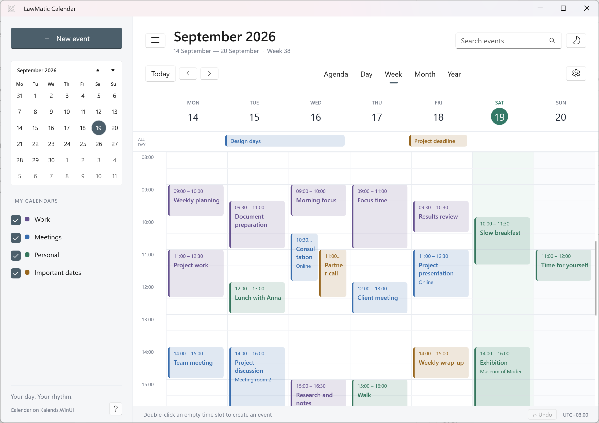
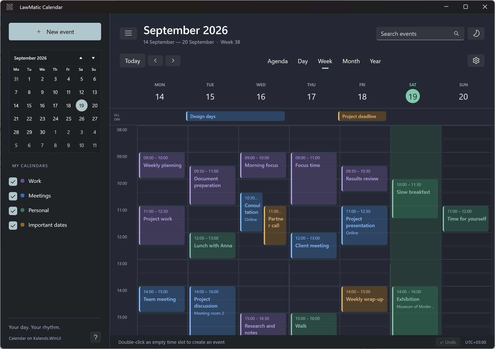

# LawMatic Calendar for Windows

Native LawMatic calendar for Windows, built on [Kalends.WinUI](https://github.com/lawlabs/kalends-winui).

<!-- GitHub About: Native LawMatic calendar for Windows, built on Kalends.WinUI. Topics: winui3, calendar, csharp. License is MIT in LICENSE — do not add a second license file when creating the repo if you will push this tree. -->

Нативный календарь LawMatic на WinUI 3. Сетка дня, недели, месяца и года берётся из Kalends.WinUI. Само приложение владеет событиями, редактором, поиском и оболочкой.





Пока пакет не опубликован, решение ссылается на соседний репозиторий:

`../kalends-winui/src/Kalends.WinUI/Kalends.WinUI.csproj`

Сначала опубликуйте `kalends-winui` в том же GitHub-аккаунте или организации. CI приложения клонирует его как соседнюю папку.

## Запуск

Нужны Windows, .NET 10 SDK, режим разработчика.

```powershell
dotnet build src/LawMatic.Calendar/LawMatic.Calendar.csproj -c Debug -p:Platform=x64
```

Запуск packaged-приложения — через Visual Studio или `winapp run` / `BuildAndRun.ps1` из рабочего каталога проекта. Не запускайте exe напрямую.

## Состав

- `src/LawMatic.Calendar` — оболочка, фильтры, диалог события, демо-данные
- Kalends рисует сетку и сообщает о переносе, создании и открытии события
