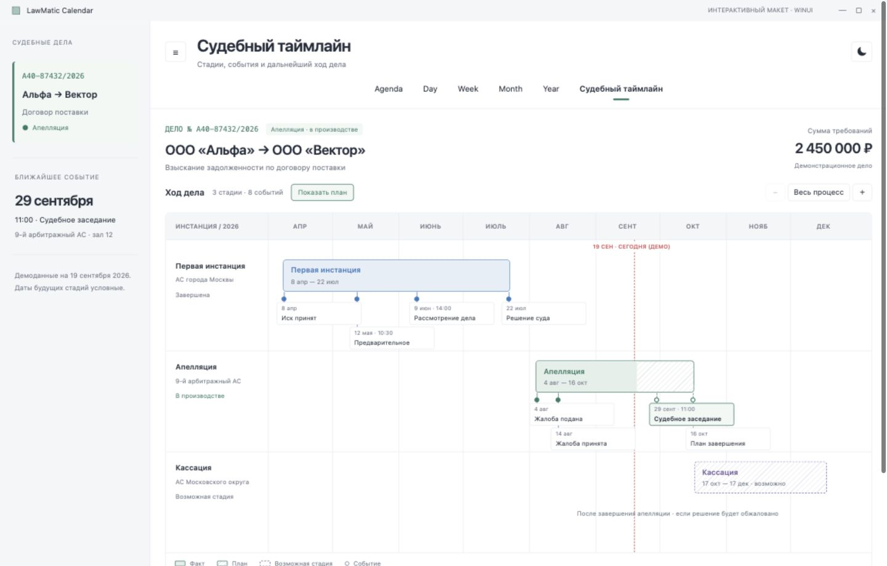

# LawMatic Calendar for Windows

Native LawMatic calendar for Windows, built on [Kalends.WinUI](https://github.com/lawlabs/kalends-winui).

<!-- GitHub About: Native LawMatic calendar for Windows, built on Kalends.WinUI. Topics: winui3, calendar, csharp. License is MIT in LICENSE — do not add a second license file when creating the repo if you will push this tree. -->

Нативный календарь LawMatic на WinUI 3. Сетка дня, недели, месяца и года берётся из Kalends.WinUI. Само приложение владеет событиями, редактором, поиском и оболочкой.


Пока пакет не опубликован, решение ссылается на соседний репозиторий:

`../kalends-winui/src/Kalends.WinUI/Kalends.WinUI.csproj`

Сначала опубликуйте `kalends-winui` в том же GitHub-аккаунте или организации. CI приложения клонирует его как соседнюю папку.

## Запуск

Нужны Windows, .NET 10 SDK, режим разработчика.

```powershell
dotnet build src/LawMatic.Calendar/LawMatic.Calendar.csproj -c Debug -p:Platform=x64
```

Запуск packaged-приложения — через Visual Studio или `winapp run` / `BuildAndRun.ps1` из рабочего каталога проекта. Не запускайте exe напрямую.

## Состав

- `src/LawMatic.Calendar` — оболочка, фильтры, диалог события, демо-данные
- Kalends рисует сетку и сообщает о переносе, создании и открытии события

## Демо «Судебный таймлайн»

После `Year` добавлена вкладка **Судебный таймлайн** (`Ctrl+6`). Это отдельный
контроль отдельной библиотеки **CourtTimeline.WinUI**; библиотека Kalends.WinUI не меняется.

### Проверить на Windows

В каталоге уже клонированного `lawmatic-calendar-windows`:

```powershell
git fetch origin
git switch --track origin/codex/court-timeline-demo
dotnet build src/LawMatic.Calendar/LawMatic.Calendar.csproj -c Debug -p:Platform=x64
```

Если локальная ветка уже существует, используйте `git switch codex/court-timeline-demo`.
Рядом должны лежать `kalends-winui` и новая библиотека `court-timeline-winui`.
Ветка ссылается на `../court-timeline-winui/src/CourtTimeline.WinUI/CourtTimeline.WinUI.csproj`.
Для CI сначала опубликуйте оба репозитория под тем же GitHub owner. Откройте
`LawMaticCalendar.slnx` в Visual Studio, выберите приложение `LawMatic.Calendar`,
платформу `x64` и профиль **LawMatic.Calendar (Package)**, затем запустите с F5.
В приложении откройте вкладку **Судебный таймлайн** после `Year` или нажмите `Ctrl+6`.
HTML-превью для этого не требуется: интерфейс нарисован нативными элементами WinUI 3.

Проверьте выбор стадий и событий, масштаб, скрытие плана, светлую и тёмную темы,
изменение размера окна и возврат в обычные режимы календаря.

Демонстрационное дело содержит завершённую первую инстанцию, текущую апелляцию,
возможную кассацию и восемь событий. Сплошная заливка означает факт, штриховка —
план, пунктирная рамка — возможную стадию. Нажатие на стадию или событие показывает
детали внизу. Доступны масштабирование, кнопка «Весь процесс», скрытие плана,
горизонтальная прокрутка и обе темы приложения.

Демо зафиксировано на **19 сентября 2026**. Будущие стадии и их даты условные;
расчёт процессуальных сроков и подключение к Legalic здесь не реализованы.

### Посмотреть без Windows

Из корня этого репозитория:

```sh
python3 -m http.server 8765 --bind 127.0.0.1
```

Откройте [интерактивное превью](http://127.0.0.1:8765/docs/court-timeline-preview.html).
Это сохранённый HTML-макет исходного прототипа, а не проверка актуальной библиотеки;
остальные режимы календаря в нём показаны только
для контекста. Полный календарь по-прежнему запускается на Windows.



[Макет в тёмной теме](docs/images/court-timeline-dark.png)

Превью и WinUI-компонент читают одни
[демоданные](src/LawMatic.Calendar/Assets/court-timeline.json). Приложение преобразует их
в публичную модель через `CourtTimelineDemo.ToTimelineData()`. Нативная отрисовка —
в соседней библиотеке `court-timeline-winui`, макет —
в `docs/court-timeline-preview.html`. Ось строится по календарным дням, конец
стадии включает весь день, события стоят в центре дня.

У библиотеки есть самостоятельный пример, тесты раскладки, NuGet-упаковка и Windows CI.
Инструкция: `../court-timeline-winui/README.md`. Нативная сборка и проверка интерфейса
WinUI требуют Windows с .NET 10 SDK.
